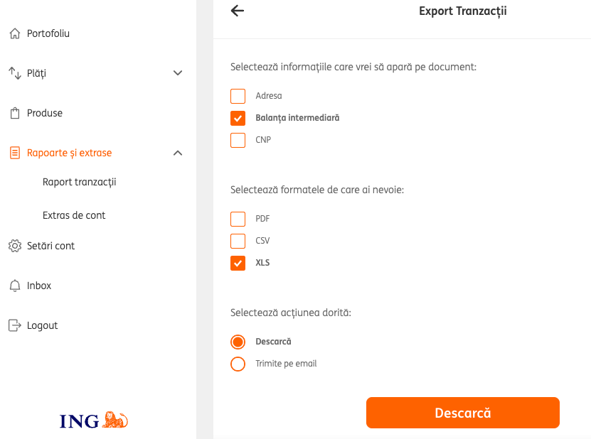
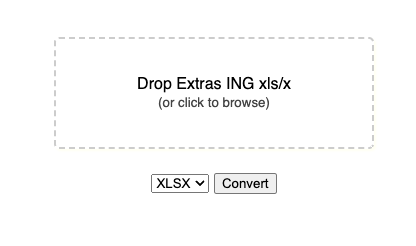

Extrage valori structurate din ING Bank **Home'Bank** _Raport tranzacții_ (xls) 

<!--  -->

## ing-parser.py

    python ing-parser.py <path/to/input/xls/x> -o <output_file> -f <xlsx|csv|json>

optional arguments

- `-f` format [xlsx, csv, json] default/implicit: xlsx
- `-o` output filename

---

## ing-parser.html

js / browser based (buggy, WIP)

&rarr; [DEMO](https://pax.github.io/ing-parser/) (<a href="https://pax.github.io/ing-parser/index.html" download="ING-parser.html">descarcă</a> și folosește offline)

## Features / Roadmap

- [x] extract fields
- [x] save as xlsx / json / csv
- [x] add params
- [x] enhance xlsx, freeze 1st row, add filters – use openpyxl 
- [x] clean-up original ING xls 
- [ ] extract currency
- [ ] extract businesses names from Terminal (before RO?)
    - [ ] business list francizes (with ID in name). Regex? – Ex: OMV, KAUFLAND, LIDL, Glovo, LUCA etc     
- [ ] categorize events / expenses
- [ ] custom, personal categorization rules
- [ ] extract adress info (country, county, internet)
- [ ] handle exceptions
    - [ ] check input file type
    - [ ] check input file structure before processing?
- [ ] batch convert
- [ ] add sample transactions xlsx
- [ ] save - detect account number?
- [ ] consolidate to db / csv?
    - [ ] **stats** / dashboard
- [x] **browser** / client-side (buggy)
    - [ ] FIXME: detect all properties
    - [ ] minimal stats
    - [x] github.io [demo](https://pax.github.io/ing-parser/)  (with inline vendor js) / PWA
    - [ ] build process for standalone / offline version 
        - [ ] Github Actions to update github.io
    - [ ] local csv repository
    - [ ] overall stats / dashboard
- [ ] sync external data
    - [ ] trezorerie, known accounts db?
    - [ ] link to registrul comertului, termene by CUI?
    - [ ] interbank exchange rate
- [ ] remove empty columns?
- [ ] extend to other banks?
    - [x] ING
    - [ ] Raiffeisen
- [ ] desktop app?
- [ ] <mark>convert to [HomeBank](https://www.gethomebank.org/help/index.html)</mark> – [custom csv](https://www.gethomebank.org/help/misc-csvformat.html).

----

    available_fields = ["Tip tranzactie", "Autorizare", "Banca", "Beneficiar", "Data", "Data valutei", "Detalii", "Din contul", "In contul", "Nr. card", "Ordonator", "Rata", "Rata ING", "Referinta", "Suma", "Suma transmisa spre decontare", "Terminal", "Cod Fiscal Platitor", "Impozit pe dobanda"]

    tip_tranzactie = ["Cumparare POS", "Incasare", "Retragere numerar", "Taxe si comisioane", "Transfer", "Transfer Home'Bank", "Depunere numerar", "Comision pe operatiune", "Schimb valutar", "Acoperire sold", "Plata poprire", "Actualizare dobanda"]

## Câmpuri 

- Data
- Detalii tranzactie
    - Tip tranzactie 
        - Cumparare POS
        - Incasare
        - Retragere numerar 
        - Taxe si comisioane
        - Transfer Homebank
    - Autorizare
    - Banca
    - Beneficiar
    - Data
    - Data valutei
    - Detalii
    - Din contul
    - In contul
    - Nr. card
    - Ordonator
    - Rata
    - Rata ING
    - Referinta
    - Suma
    - Suma transmisa spre decontare
    - Terminal
- Debit	
- Credit	
- Balanta

---

## See also

GPT threads: [1](https://chat.openai.com/share/fe3ce803-2c4e-4c74-9426-e1447899384a), [2](https://chat.openai.com/share/f4c7ddb8-dfc4-40c2-a235-0f3414f7e3d3); 
Similar work / inspiration: [topics/homebank](https://github.com/topics/homebank),  [cwverhey/HomeBankCSV](https://github.com/cwverhey/HomeBankCSV), [Binnette/homebank-converter](https://github.com/Binnette/homebank-converter), [sercxanto/go-homebank-csv](https://github.com/sercxanto/go-homebank-csv)   